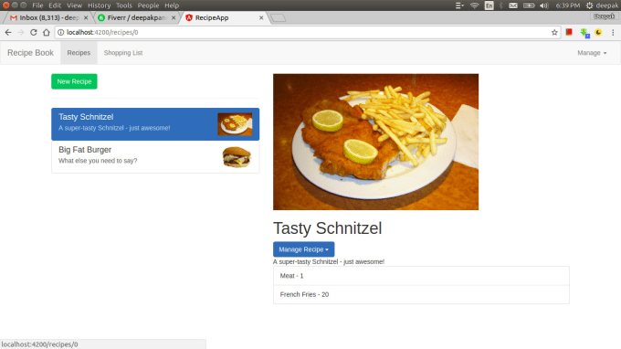

## [Recipes Book (click to see demo)](https://ng-recipe-book-b01a5.firebaseapp.com/)

[Angular 8 - The Complete Guide (2019+ Edition) | Udemy](https://www.udemy.com/course/the-complete-guide-to-angular-2/)

## DEMO
[Click to see application in action](https://ng-recipe-book-b01a5.firebaseapp.com/)

## Tags

- [v1.0](https://github.com/KulovacNedim/recipes-book/tree/v1.0) - Full (basic) application
- [v2.0](https://github.com/KulovacNedim/recipes-book/tree/v2.0) - Version with ngrx for state management
- [v3.0](https://github.com/KulovacNedim/recipes-book/tree/v3.0) - Angular Universal rendering implemented

## Clone

Clone this repo to your local machine using `https://github.com/KulovacNedim/recipes-book.git`
and run `npm init` to install all dependencies

## Available Scripts

In the project directory, you can run:

### `npm start`

Runs the app in the development mode.
Open [http://localhost:4200](http://localhost:4200) to view it in the browser.

### `npm run build`

Builds the app for production to the `build` folder. 
